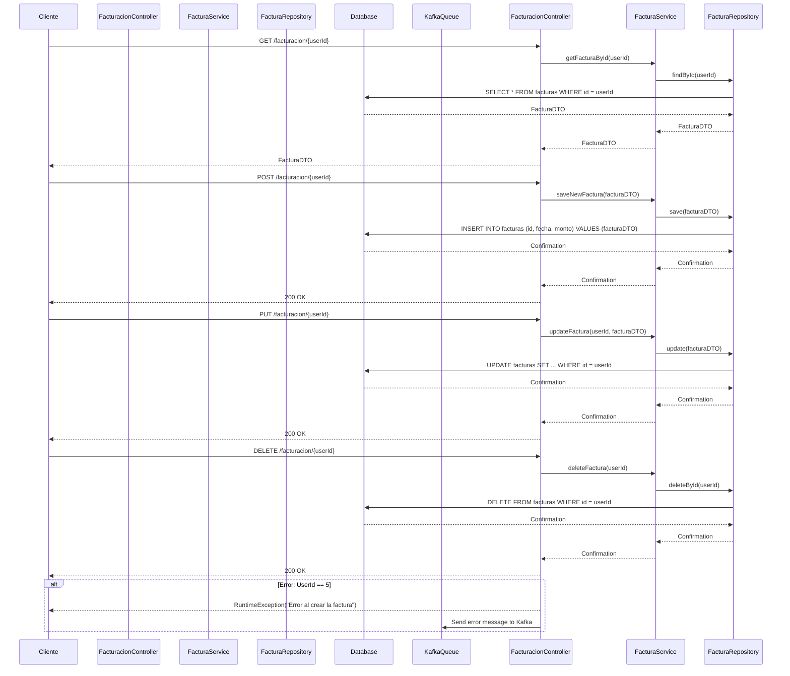
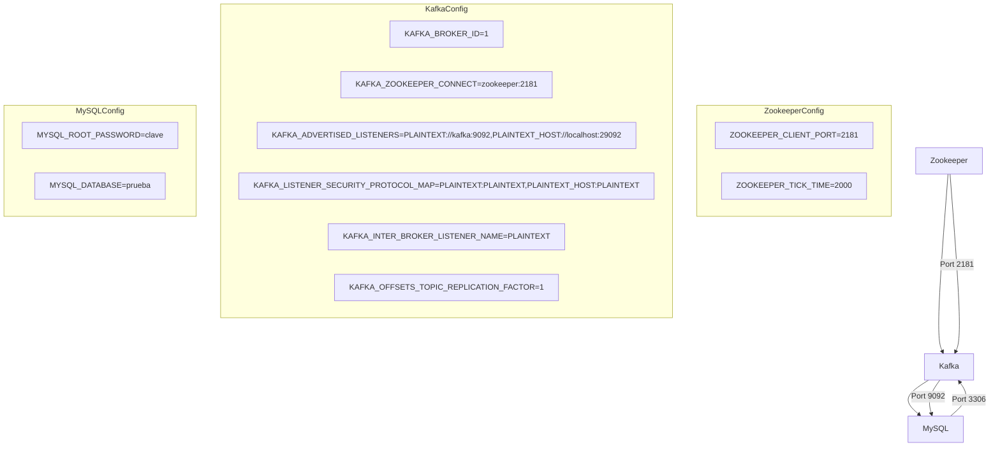
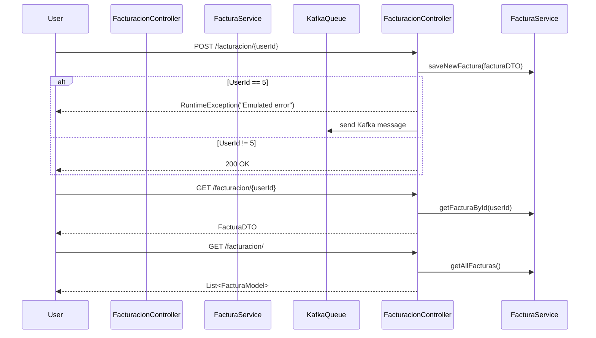
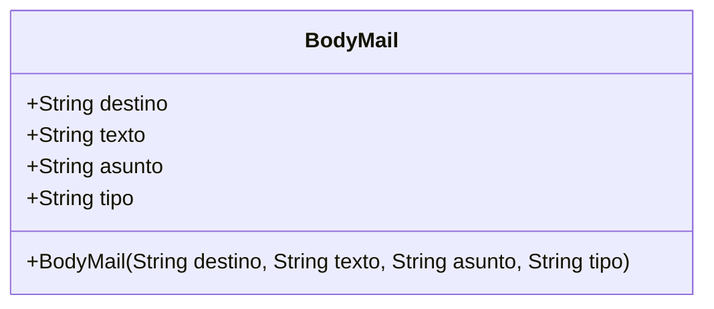
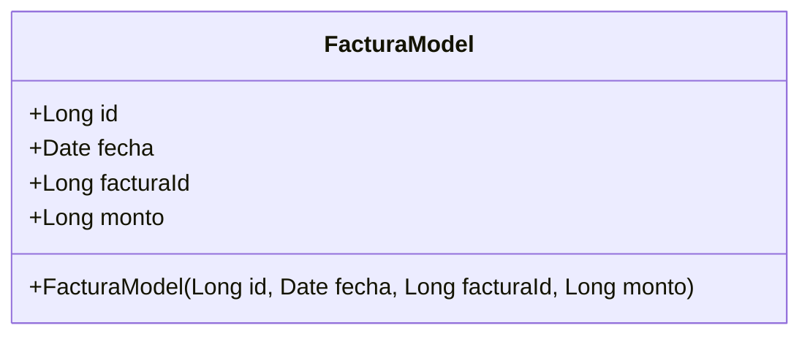

## Descripcion de proyecto
Este proyecto es una prueba de concepto que integra **Spring Boot** con **Kafka** para un servicio de facturación. En caso de fallo (simulado con una excepción), la cola de Kafka gestiona la contingencia.
El microservicio envía datos por Kafka para el envío de un correo electrónico. Aunque el envío lo maneja el microservicio, los datos necesarios están definidos en el archivo `application.properties`.
En la siguente revision de dara utilizad a la integracion con gRPC
### Tecnologias
- Docker Compose
- Kafka
- gRPC
- UML
- Mapper
- Java
- MySQL
- JPA
- Lombook
## Build
Para correr el proyecto primero se requiere correr el docker-compose a fin de tener las dependencias necesarias como
- MySQL
- Kafka
- Zookeeper.

Para lo cual es requisito tener en la pc el servicio de 
 > `docker-compose`.
 
En caso de no disponer del mismo verificar la documentacion oficial para su instalacion.
Comandos para correr atraves de docker-compose.
```bash
docker-compose up -d
```
Una ves realizado los procedimientos para docker-compose se puede proceder a correr el proyecto con springboot o atraves de la CLI.
Se deja a criterio del usuario la eleccion.
### Proyecto

##### Descripcion de microservicios


### Descripcion del servicio ApiRest

Se genera una excepcion para poder iniciar el mensaje atraves del sistema de mensajeria de kafka.

### Modelado de datos
##### Email Clase

#### Factura Entidad
En ambos casos se utiliza el modelo buildler para la construccion de los objetos

### Arbol de arquitectura de proyecto
Detalle de las capas del proyecto

```
├── controller
│   └── FacturacionController.java
├── Demo2Application.java
├── dto
│   ├── BodyMail.java
│   └── FacturaDTO.java
├── exceptions
│   └── HandleExceptionCustomicer.java
├── grpc
│   └── grpcIntento.java
├── interceptorsJPA
│   └── FacturaInterceptorJPA.java
├── kafka
│   ├── EventServiceImpl.java
│   ├── producter
│   │   ├── KafkaProducterSender.java
│   │   └── topic
│   │       └── KafkaProducterTopic.java
│   ├── PruebaKafkaConsumer.java
│   └── setting
│       └── KafkaProducterSetting.java
├── kafkaLister.java
├── mappers
│   └── FacturacionMapper.java
├── models
│   └── FacturaModel.java
├── repository
│   └── facturaRepository.java
├── service
│   └── FacturaService.java
└── utils
    ├── MailDefault.java
    └── Utils.java
```

